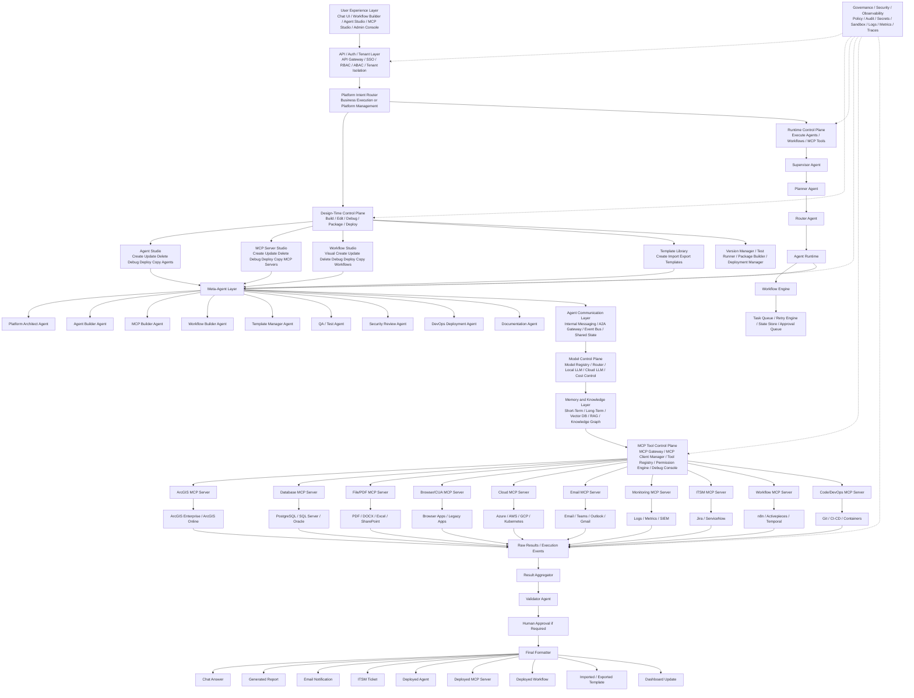

# Product Requirements Document (PRD)

# Enterprise AI + MCP + Multi-Agent + Workflow Builder Platform

**Document Version:** 1.0  
**Date:** 2026-05-18  
**Prepared For:** Enterprise AI Agent Orchestration Platform Development  
**Primary Objective:** Build a full platform where users can create, update, delete, debug, deploy, copy, template, import, export, and visually orchestrate AI agents, MCP servers, and workflows.

---

## 1. Executive Summary

The product is an enterprise-grade AI Agent Orchestration Platform that allows business users, administrators, GIS operators, developers, and automation teams to design and run intelligent workflows using natural language, visual workflows, AI agents, and Model Context Protocol (MCP) servers.

The platform combines:

- Natural-language chat interface.
- Visual workflow builder similar to Flowise / React Flow style builders.
- Multi-agent orchestration.
- Agent-to-agent communication.
- MCP-based agent-to-tool integration.
- Full lifecycle management for agents.
- Full lifecycle management for MCP servers.
- Full lifecycle management for workflows.
- Template creation, import, export, and reuse.
- Debugging, deployment, versioning, rollback, monitoring, and governance.
- Enterprise security, RBAC/ABAC, audit, observability, and human approval.
- Support for local and cloud LLM models.
- Support for enterprise systems such as ArcGIS Enterprise, databases, cloud platforms, files, browser automation, email, ITSM, monitoring, and DevOps tools.

The final product should act as a **factory for building and operating AI-powered enterprise automation systems**.

---

## 2. Product Vision

Enable any organization to build, operate, and govern AI agents and MCP-powered automation workflows through a unified platform.

The platform should allow a user to write prompts such as:

> Create a GIS Health Monitoring Agent that checks ArcGIS Portal, ArcGIS Server, Data Store, database, and logs, then creates a report and emails it every morning.

The system should transform the prompt into:

1. An agent specification.
2. Required MCP server/tool access.
3. A visual workflow.
4. Test cases.
5. Security policies.
6. Deployment configuration.
7. Production runtime schedule.
8. Monitoring and audit trail.

---

## 3. Problem Statement

Current automation and AI-agent tools are fragmented:

| Problem | Impact |
|---|---|
| Agents are difficult to build and govern | No standard enterprise lifecycle |
| Tools are hard-coded into agents | Poor portability and weak security |
| Workflow builders are separate from agent runtimes | No unified design-to-execution lifecycle |
| MCP servers are created manually | Slow onboarding of enterprise systems |
| Debugging agent/tool workflows is difficult | Hard to trust production automations |
| No strong approval and governance model | Risky automation and compliance gaps |
| No unified template system | Teams repeatedly rebuild the same assets |
| No clear separation between agent-to-agent and agent-to-tool communication | Architecture becomes fragile |

This platform solves those gaps by combining:

- **A2A-style communication** for agent-to-agent collaboration.
- **MCP** for agent-to-tool communication.
- **Visual workflow builder** for human-readable orchestration.
- **Design-time control plane** for creating and managing assets.
- **Runtime control plane** for executing assets.
- **Governance/security/observability plane** for production readiness.

---

## 4. Goals and Non-Goals

### 4.1 Goals

| Goal ID | Goal |
|---|---|
| G-01 | Allow users to create, update, delete, debug, deploy, and copy AI agents. |
| G-02 | Allow users to create, update, delete, debug, deploy, and copy MCP servers. |
| G-03 | Allow users to visually create, update, delete, debug, deploy, and copy workflows. |
| G-04 | Allow users to create, import, export, and reuse templates. |
| G-05 | Support multi-agent orchestration and agent-to-agent communication. |
| G-06 | Support MCP server integration through a controlled MCP Gateway and MCP Client Manager. |
| G-07 | Support enterprise-grade security, RBAC, ABAC, audit, approvals, and policy-as-code. |
| G-08 | Support local and cloud LLM routing. |
| G-09 | Support durable execution, retries, scheduling, human approval, and rollback. |
| G-10 | Provide observability for agents, tools, workflows, prompts, tokens, costs, logs, metrics, and traces. |
| G-11 | Support ArcGIS Enterprise, databases, files, cloud, browser/CUA, email, monitoring, ITSM, and DevOps integrations. |
| G-12 | Provide an extensible architecture for future agents, MCP servers, templates, and marketplaces. |

### 4.2 Non-Goals for MVP

| Non-Goal | Explanation |
|---|---|
| Fully autonomous destructive actions without approval | Delete/admin/remediation actions require approval. |
| Unlimited external plugin execution | All tools must pass validation and governance. |
| Replacing enterprise IAM | The platform integrates with enterprise IAM. |
| Replacing ITSM systems | The platform creates/updates tickets but does not replace ServiceNow/Jira. |
| Replacing full RPA suites in MVP | Browser/CUA automation is included but advanced enterprise RPA parity is later phase. |

---

## 5. Target Users and Personas

| Persona | Description | Primary Needs |
|---|---|---|
| Business User | Non-technical user who writes prompts and runs workflows | Simple chat, templates, approval, results |
| Automation Builder | Builds workflows and agents visually | Workflow builder, templates, debugging |
| MCP Developer | Builds custom MCP servers | MCP Studio, code generation, testing, deployment |
| AI Agent Designer | Creates specialized agents | Agent Studio, prompts, tools, memory, tests |
| GIS Administrator | Operates ArcGIS Enterprise/Online | GIS agents, ArcGIS MCP tools, health workflows |
| Database Administrator | Supports enterprise databases | DB MCP server, safe SQL, monitoring |
| Security Officer | Reviews risk and access | RBAC, approvals, audit, policy-as-code |
| DevOps Engineer | Deploys platform assets | CI/CD, Kubernetes, GitOps, rollback |
| Platform Admin | Manages tenants, users, agents, MCP servers, workflows | Governance, monitoring, permissions |

---

## 6. Definitions and Core Concepts

| Term | Definition |
|---|---|
| Agent | AI-powered worker with role, instructions, model config, memory, permissions, and tool access. |
| Multi-Agent System | Group of agents that collaborate on complex tasks. |
| MCP | Model Context Protocol, used to connect AI applications to external tools, resources, prompts, data, and systems. |
| MCP Server | Server exposing tools, resources, and prompts to AI hosts/clients. |
| MCP Client | Runtime client connection from host/orchestrator to an MCP server. |
| MCP Gateway | Central platform layer that governs, routes, logs, validates, and controls MCP tool access. |
| A2A | Agent-to-Agent communication layer/protocol for agent collaboration. |
| Workflow | Node/edge graph defining agents, tools, tasks, decisions, approvals, and outputs. |
| Template | Reusable packaged definition for agents, MCP servers, or workflows. |
| Design-Time Plane | Area where users create, edit, debug, package, deploy, and template assets. |
| Runtime Plane | Area where workflows and agents execute. |
| Meta-Agent | Agent that creates or manages other agents, MCP servers, workflows, tests, docs, or deployments. |
| Human-in-the-Loop | Approval step before high-risk actions. |

---

## 7. Final Product Scope

The platform must support three main asset types:

1. **Agents**
2. **MCP Servers**
3. **Workflows**

Each asset type must support the following lifecycle operations:

```text
Create
Update
Delete
Debug
Deploy
Copy
Create Template
Import Template
Export Template
Version
Rollback
Audit
Approve
Monitor
```

---

## 8. High-Level Product Capabilities

### 8.1 User Experience Capabilities

| Capability | Description |
|---|---|
| Chat UI | Users create/run/manage assets using natural language. |
| Visual Workflow Builder | Users draw workflows using nodes and edges. |
| Agent Studio | Create and manage agents. |
| MCP Server Studio | Create and manage MCP servers. |
| Template Library | Browse, create, import, export, and reuse templates. |
| Admin Console | Tenants, users, permissions, policies, models, secrets, environments. |
| Execution Monitor | View workflow runs, logs, traces, status, failures, and retries. |
| Debug Console | Step-by-step debugging, replay, test inputs, tool-call inspection. |

### 8.2 Platform Management Capabilities

| Capability | Description |
|---|---|
| Platform Intent Router | Classifies user prompt into business execution or platform management. |
| Agent Builder Agent | Generates/updates/copies/debugs/deploys agents. |
| MCP Builder Agent | Generates/updates/copies/debugs/deploys MCP servers. |
| Workflow Builder Agent | Converts prompt or visual graph into executable workflow. |
| Template Manager Agent | Manages reusable templates. |
| QA/Test Agent | Generates and runs tests. |
| Security Review Agent | Reviews risky tools, permissions, secrets, and policies. |
| DevOps Deployment Agent | Builds containers, deploys, validates, rolls back. |
| Documentation Agent | Generates README, diagrams, API docs, release notes. |

### 8.3 Runtime Capabilities

| Capability | Description |
|---|---|
| Supervisor Agent | Controls execution and coordination. |
| Planner Agent | Breaks user request into tasks. |
| Router Agent | Assigns tasks to specialist agents. |
| Agent Runtime | Executes agents and manages model calls. |
| Workflow Engine | Runs long-running workflows with state and retries. |
| Task Queue | Manages async/background work. |
| State Store | Stores workflow state, run status, outputs, and checkpoints. |
| Approval Queue | Handles human approval for risky actions. |
| Result Aggregator | Combines outputs from agents/tools. |
| Validator Agent | Checks correctness, completeness, safety. |
| Final Formatter | Produces chat answer, report, email, ticket, dashboard update. |

---

## 9. Full Final Architecture

### 9.1 Architecture Overview

```text
User
 ↓
Chat UI / Visual Builder / Agent Studio / MCP Studio / Admin Console
 ↓
API Gateway / Auth / Tenant Management
 ↓
Platform Intent Router
 ↓
Design-Time Control Plane OR Runtime Control Plane
 ↓
Meta-Agent Layer
 ↓
Agent Communication Layer
 ↓
Model Control Plane
 ↓
Memory / Knowledge Layer
 ↓
MCP Tool Control Plane
 ↓
MCP Server Layer
 ↓
Enterprise Systems / Tools
 ↓
Results / Events
 ↓
Aggregator + Validator + Human Approval
 ↓
Final Output
```

### 9.2 Main Architecture Diagram

```text
┌──────────────────────────────────────────────────────────────────────────────┐
│                            USER EXPERIENCE LAYER                             │
│                                                                              │
│  Chat UI | Visual Workflow Builder | Agent Studio | MCP Studio | Admin Console│
│                                                                              │
│  User Actions:                                                               │
│  - Ask prompt                                                                 │
│  - Create/update/delete/debug/deploy/copy agent                               │
│  - Create/update/delete/debug/deploy/copy MCP server                          │
│  - Create/update/delete/debug/deploy/copy workflow                            │
│  - Create/import/export templates                                             │
└──────────────────────────────────────┬───────────────────────────────────────┘
                                       ▼
┌──────────────────────────────────────────────────────────────────────────────┐
│                          API / AUTH / TENANT LAYER                           │
│                                                                              │
│  API Gateway | WebSocket | SSO/OAuth | RBAC/ABAC | Tenant/Project Isolation   │
└──────────────────────────────────────┬───────────────────────────────────────┘
                                       ▼
┌──────────────────────────────────────────────────────────────────────────────┐
│                            PLATFORM INTENT ROUTER                            │
│                                                                              │
│  Classifies request into:                                                     │
│  1. Business execution                                                        │
│  2. Agent lifecycle management                                                │
│  3. MCP server lifecycle management                                           │
│  4. Workflow lifecycle management                                             │
│  5. Template lifecycle management                                             │
└──────────────────────────────┬───────────────────────────────────────────────┘
                               │
        ┌──────────────────────┴──────────────────────┐
        ▼                                             ▼
┌──────────────────────────────────────┐   ┌───────────────────────────────────┐
│         DESIGN-TIME CONTROL PLANE    │   │       RUNTIME CONTROL PLANE       │
│                                      │   │                                   │
│  Agent Studio                        │   │  Supervisor Agent                 │
│  MCP Server Studio                   │   │  Planner Agent                    │
│  Workflow Studio                     │   │  Router Agent                     │
│  Template Library                    │   │  Agent Runtime                    │
│  Import / Export Manager             │   │  Workflow Engine                  │
│  Version Manager                     │   │  Task Queue                       │
│  Debug Console                       │   │  State Store                      │
│  Test Runner                         │   │  Retry Engine                     │
│  Package Builder                     │   │  Human Approval                   │
│  Deployment Manager                  │   │  Result Aggregator                │
│  Security Scanner                    │   │  Validator Agent                  │
│  Approval Manager                    │   │  Final Formatter                  │
└──────────────────────┬───────────────┘   └──────────────────┬────────────────┘
                       │                                      │
                       ▼                                      ▼
┌──────────────────────────────────────────────────────────────────────────────┐
│                            META-AGENT LAYER                                  │
│                                                                              │
│  Platform Architect Agent | Agent Builder Agent | MCP Builder Agent           │
│  Workflow Builder Agent | Template Manager Agent | QA/Test Agent              │
│  Security Review Agent | DevOps Deployment Agent | Documentation Agent        │
└──────────────────────────────────────┬───────────────────────────────────────┘
                                       ▼
┌──────────────────────────────────────────────────────────────────────────────┐
│                         AGENT COMMUNICATION LAYER                            │
│                                                                              │
│  Internal Messaging | A2A Gateway | Event Bus | Shared Workflow State         │
└──────────────────────────────────────┬───────────────────────────────────────┘
                                       ▼
┌──────────────────────────────────────────────────────────────────────────────┐
│                            MODEL CONTROL PLANE                               │
│                                                                              │
│  Model Registry | Model Router | Local LLM | Cloud LLM | Fallback             │
│  Cost Control | Token Budget | Prompt Registry | Evaluation Scores            │
└──────────────────────────────────────┬───────────────────────────────────────┘
                                       ▼
┌──────────────────────────────────────────────────────────────────────────────┐
│                            MEMORY / KNOWLEDGE LAYER                          │
│                                                                              │
│  Short-Term Memory | Long-Term Memory | Vector DB | RAG | Knowledge Graph     │
│  Agent Memory | Workflow State | User/Project Context                         │
└──────────────────────────────────────┬───────────────────────────────────────┘
                                       ▼
┌──────────────────────────────────────────────────────────────────────────────┐
│                              MCP TOOL CONTROL PLANE                          │
│                                                                              │
│  MCP Gateway | MCP Client Manager | Tool Registry | Resource Registry         │
│  Prompt Registry | Tool Permission Engine | Tool Validator                    │
│  Tool Execution Log | MCP Debug Console | Tool Sandbox                        │
└──────────────────────────────────────┬───────────────────────────────────────┘
                                       ▼
┌──────────────────────────────────────────────────────────────────────────────┐
│                                MCP SERVER LAYER                              │
│                                                                              │
│  ArcGIS MCP | Database MCP | File/PDF MCP | Browser/CUA MCP                  │
│  Cloud MCP | Email MCP | Monitoring MCP | ITSM MCP | Workflow MCP | DevOps MCP │
└──────────────────────────────────────┬───────────────────────────────────────┘
                                       ▼
┌──────────────────────────────────────────────────────────────────────────────┐
│                          ENTERPRISE SYSTEMS / TOOLS                          │
│                                                                              │
│  ArcGIS Enterprise / ArcGIS Online / PostgreSQL / SQL Server / Oracle         │
│  Azure / AWS / GCP / Kubernetes / Files / SharePoint / Browser Apps           │
│  Email / Teams / Jira / ServiceNow / Logs / Metrics / SIEM / Git / CI/CD      │
└──────────────────────────────────────┬───────────────────────────────────────┘
                                       ▼
┌──────────────────────────────────────────────────────────────────────────────┐
│                        GOVERNANCE / SECURITY / OBSERVABILITY                 │
│                                                                              │
│  Policy | Audit | Secrets | Sandbox | Logs | Metrics | Traces | Cost | Replay │
└──────────────────────────────────────┬───────────────────────────────────────┘
                                       ▼
┌──────────────────────────────────────────────────────────────────────────────┐
│                               FINAL OUTPUT                                   │
│                                                                              │
│  Chat Answer | Report | Email | ITSM Ticket | Deployed Agent                 │
│  Deployed MCP Server | Deployed Workflow | Template | Dashboard Update        │
└──────────────────────────────────────────────────────────────────────────────┘
```

### 9.3 Mermaid Diagram



---

## 10. System Modules

### 10.1 User Experience Layer

| Module | Description | Key Features |
|---|---|---|
| Chat UI | Natural language interface | Ask, create, update, debug, deploy, run |
| Visual Workflow Builder | Node-based workflow designer | Drag/drop, connect nodes, templates, validation |
| Agent Studio | Agent lifecycle UI | Create/update/delete/debug/deploy/copy agents |
| MCP Studio | MCP server lifecycle UI | Generate tools, test calls, deploy servers |
| Template Library | Reusable asset catalog | Create/import/export/copy templates |
| Admin Console | Platform administration | Users, tenants, models, secrets, policies |
| Execution Monitor | Runtime observability | Runs, logs, traces, replay, status |
| Debug Console | Debug assets | Step-run, inspect tool calls, test cases |

### 10.2 API / Access / Tenant Layer

| Module | Description |
|---|---|
| API Gateway | Main entrypoint for UI, CLI, integrations, webhooks |
| WebSocket Gateway | Real-time updates for workflow execution and logs |
| Auth Service | SSO/OAuth/OIDC integration |
| RBAC/ABAC Service | Role and attribute-based authorization |
| Tenant Service | Multi-tenant isolation by organization/project/environment |
| Rate Limit Service | Prevent abuse and control usage |

### 10.3 Platform Intent Router

The router must classify user requests into one or more categories:

| Intent Type | Example |
|---|---|
| Business Execution | Run GIS health check workflow |
| Agent Lifecycle | Create a new GIS agent |
| MCP Lifecycle | Debug ArcGIS MCP server |
| Workflow Lifecycle | Copy workflow and deploy to staging |
| Template Lifecycle | Import workflow template from ZIP |
| Admin / Governance | Add policy requiring approval for delete actions |
| Monitoring / Audit | Show all failed tool calls today |

### 10.4 Design-Time Control Plane

| Module | Description |
|---|---|
| Agent Studio | Defines and manages agent specifications |
| MCP Server Studio | Defines and manages MCP server specifications/code/packages |
| Workflow Studio | Defines and manages visual workflow specifications |
| Template Library | Stores reusable templates |
| Import/Export Manager | Handles JSON/YAML/ZIP packages |
| Version Manager | Stores all asset versions and supports rollback |
| Debug Console | Debugs agent/MCP/workflow assets |
| Test Runner | Runs unit, integration, security, and simulation tests |
| Package Builder | Creates container/package artifacts |
| Deployment Manager | Deploys assets to dev/test/prod |
| Security Scanner | Scans code, dependencies, images, manifests |
| Approval Manager | Manages approval gates for deploy/delete/risky operations |

### 10.5 Runtime Control Plane

| Module | Description |
|---|---|
| Supervisor Agent | Coordinates the full execution |
| Planner Agent | Converts request into task graph |
| Router Agent | Selects agents/tools/workflows |
| Agent Runtime | Executes specialist and meta-agents |
| Workflow Engine | Durable workflow execution |
| Task Queue | Async execution and worker distribution |
| State Store | Saves workflow and task state |
| Retry Engine | Retries failed nodes based on policy |
| Scheduler | Runs recurring workflows |
| Human Approval Queue | Pauses workflows until approved/rejected |
| Result Aggregator | Combines outputs |
| Validator Agent | Checks output safety/correctness |
| Final Formatter | Produces result in correct channel |

---

## 11. Core Asset Lifecycle Requirements

### 11.1 Agent Lifecycle

| Operation | Requirement | Acceptance Criteria |
|---|---|---|
| Create Agent | User can create agent from prompt, form, or template | Agent draft is created with name, role, instructions, model, tools, memory, policies |
| Update Agent | User can update all editable fields | New version is created; previous version preserved |
| Delete Agent | User can archive/delete agent | Platform checks dependencies before deletion |
| Debug Agent | User can run test prompts and inspect tool calls | Debug trace shows prompt, model response, tool calls, outputs, errors |
| Deploy Agent | User can deploy to dev/test/prod | Tests and approvals pass before production deploy |
| Copy Agent | User can clone existing agent | New agent ID created with copied config and editable name |
| Create Template | User can save agent as template | Secrets removed; parameters generalized |
| Import Template | User can import agent template | Schema validation and security scan pass |
| Export Template | User can export agent template | Export includes manifest, config, tests, docs; excludes secrets |
| Rollback Agent | User can rollback to previous version | Runtime switches to selected approved version |

### 11.2 MCP Server Lifecycle

| Operation | Requirement | Acceptance Criteria |
|---|---|---|
| Create MCP Server | User can generate MCP server from prompt/API/OpenAPI/database schema | Server manifest, tools, resources, prompts, tests created |
| Update MCP Server | User can modify tools/resources/prompts | New version created; tests rerun |
| Delete MCP Server | User can archive/delete server | Dependency scan identifies affected agents/workflows |
| Debug MCP Server | User can test tools and inspect protocol messages | Tool input/output, schema validation, errors visible |
| Deploy MCP Server | User can deploy server locally, containerized, or remote | Health check passes; tool registry updated |
| Copy MCP Server | User can clone MCP server | New server ID and environment-specific secrets required |
| Create Template | User can save MCP server as template | Secrets removed; endpoints parameterized |
| Import Template | User can import MCP package/template | Package signature, schema, dependency, and security checks run |
| Export Template | User can export MCP package | Includes manifest, schema, tests, docs; excludes secrets |
| Rollback MCP Server | User can rollback to approved version | Tool registry points to previous version |

### 11.3 Workflow Lifecycle

| Operation | Requirement | Acceptance Criteria |
|---|---|---|
| Create Workflow | User can draw or generate workflow | Workflow graph created with nodes/edges/variables |
| Update Workflow | User can modify graph, nodes, variables, policies | New version is created |
| Delete Workflow | User can archive/delete workflow | Dependencies and schedules checked |
| Debug Workflow | User can step through workflow | Node-level traces and outputs visible |
| Deploy Workflow | User can promote to dev/test/prod | Validation, tests, approvals pass |
| Copy Workflow | User can clone workflow | New workflow ID and editable metadata created |
| Create Template | User can save workflow as template | Inputs parameterized; secrets removed |
| Import Template | User can import workflow template | Required agents/MCP servers mapped or created |
| Export Template | User can export workflow package | Includes graph, configs, tests, docs; excludes secrets |
| Rollback Workflow | User can rollback version | Scheduler/routing uses selected version |

---

## 12. Agent Types

### 12.1 Runtime Business Agents

| Agent | Purpose |
|---|---|
| GIS Agent | ArcGIS Enterprise/Online operations, maps, services, users, groups, logs |
| Database Agent | SQL/database health, safe queries, schema inspection |
| Browser Agent | Playwright/CUA/browser automation |
| File/Document Agent | PDF, DOCX, Excel, report generation |
| Security Agent | Permissions, risk review, compliance checks |
| Cloud Agent | Azure/AWS/GCP/Kubernetes operations |
| Monitoring Agent | Logs, metrics, alerts, system health |
| Report Agent | Executive/technical report creation |
| Email/Notification Agent | Email, Teams, Slack notifications |
| ITSM Agent | Jira/ServiceNow ticket creation/update |
| DevOps Agent | Git, CI/CD, deployment, rollback |

### 12.2 Meta-Agents

| Meta-Agent | Purpose |
|---|---|
| Platform Architect Agent | Designs complete solutions from prompt |
| Agent Builder Agent | Creates/updates/debugs/deploys/copies agents |
| MCP Builder Agent | Creates/updates/debugs/deploys/copies MCP servers |
| Workflow Builder Agent | Creates/updates/debugs/deploys/copies workflows |
| Template Manager Agent | Creates/imports/exports templates |
| QA/Test Agent | Creates and executes tests |
| Security Review Agent | Performs risk and permission review |
| DevOps Deployment Agent | Packages, deploys, validates, and rolls back assets |
| Documentation Agent | Generates docs, diagrams, changelogs, README files |
| Migration Agent | Converts workflows from n8n/Flowise/Dify/JSON/YAML where possible |
| Governance Agent | Checks compliance with enterprise policies |

---

## 13. Agent Communication Design

### 13.1 Communication Rules

```text
Agents communicate with agents.
Agents use MCP clients to call MCP servers.
MCP servers expose tools/resources/prompts.
MCP servers should not normally orchestrate other MCP servers.
The orchestrator controls the full workflow.
```

### 13.2 Communication Patterns

| Pattern | Use Case |
|---|---|
| Orchestrator-mediated messages | Default enterprise pattern |
| Shared workflow state | Agents share task outputs and checkpoints |
| Event bus | Large-scale asynchronous communication |
| A2A gateway | External/vendor/cross-framework agent communication |
| Direct agent message | Advanced use only, with policy control |

### 13.3 Agent Message Schema

```json
{
  "message_id": "msg_123",
  "conversation_id": "conv_456",
  "workflow_run_id": "run_789",
  "from_agent": "gis_agent",
  "to_agent": "report_agent",
  "message_type": "task_result",
  "priority": "normal",
  "payload": {
    "summary": "ArcGIS Portal healthy; two services stopped",
    "data_ref": "state://run_789/gis_health_result"
  },
  "created_at": "2026-05-18T12:00:00Z"
}
```

---

## 14. MCP Tool Control Plane

### 14.1 Required Components

| Component | Description |
|---|---|
| MCP Gateway | Single controlled access point for MCP tools |
| MCP Client Manager | Manages sessions to multiple MCP servers |
| Tool Registry | Stores tool metadata, schemas, owners, risk levels |
| Resource Registry | Stores MCP resources and access rules |
| Prompt Registry | Stores reusable MCP prompts/templates |
| Tool Permission Engine | Enforces who/what can call each tool |
| Tool Validator | Validates arguments, schemas, policies |
| Tool Execution Log | Stores all tool calls and outputs |
| MCP Debug Console | Allows testing tools and MCP servers |
| Tool Sandbox | Isolates risky tools and command execution |

### 14.2 MCP Server Types

| MCP Server | Example Tools |
|---|---|
| ArcGIS MCP Server | portal_health, list_services, restart_service, check_datastore, query_logs |
| Database MCP Server | check_db_health, inspect_schema, run_safe_query, analyze_slow_queries |
| File/PDF MCP Server | read_pdf, extract_tables, create_report, export_docx, export_pdf |
| Browser/CUA MCP Server | open_page, click_button, fill_form, capture_screen, read_ui_state |
| Cloud MCP Server | list_vms, check_resource_health, inspect_logs, restart_service |
| Email MCP Server | create_draft, send_email, notify_user |
| Monitoring MCP Server | query_logs, get_metrics, analyze_alerts |
| ITSM MCP Server | create_ticket, update_ticket, attach_report |
| Workflow MCP Server | trigger_n8n, trigger_activepieces, run_temporal_workflow |
| DevOps MCP Server | create_branch, run_pipeline, deploy_container, rollback_release |

### 14.3 Tool Risk Levels

| Risk Level | Examples | Required Control |
|---|---|---|
| L0 Read-only | List services, inspect schema | Normal RBAC |
| L1 Low-risk write | Create draft, create report | RBAC + audit |
| L2 Operational write | Restart service, update metadata | Approval based on policy |
| L3 Destructive | Delete item, drop table, remove user | Mandatory approval |
| L4 Admin/system | Execute script, modify IAM, deploy infra | Security approval + sandbox + audit |

---

## 15. Workflow Builder Requirements

### 15.1 Node Types

| Node Type | Description |
|---|---|
| Trigger Node | Manual, chat, webhook, schedule, event |
| Agent Node | Calls an AI agent |
| MCP Tool Node | Calls a specific MCP tool |
| Decision Node | Conditional branching |
| Transform Node | Format, map, filter, convert data |
| Approval Node | Human approval checkpoint |
| Loop Node | Iterate over items |
| Parallel Node | Run branches concurrently |
| Error Handler Node | Retry/fallback path |
| Notification Node | Email/Teams/Slack |
| Report Node | Generate PDF/DOCX/Markdown |
| ITSM Node | Create/update ticket |
| Template Node | Reusable sub-workflow |
| Script Node | Controlled script execution |
| Memory Node | Read/write memory |
| RAG Node | Retrieve documents/context |

### 15.2 Workflow Designer Features

| Feature | Requirement |
|---|---|
| Drag and drop | Users can add nodes visually |
| Connect nodes | Users can define edges and execution flow |
| Node config panel | Users configure inputs, outputs, tool selection, retry, approvals |
| Auto-layout | System can organize graph visually |
| Validation | Detect disconnected nodes, invalid tools, missing inputs |
| Dry-run | Run with mock/test data |
| Debug mode | Step-by-step node execution |
| Replay | Replay previous workflow runs |
| Versioning | Save versions and compare diffs |
| Template save | Save workflow as reusable template |
| Import/export | JSON/YAML/ZIP formats |
| Deploy | Promote to environments |
| Rollback | Return to previous workflow version |
| Execution monitor | Real-time run status and logs |

---

## 16. Template System Requirements

### 16.1 Template Types

| Template Type | Examples |
|---|---|
| Agent Template | GIS Health Agent, Database Audit Agent, Report Agent |
| MCP Server Template | ArcGIS MCP, PostgreSQL MCP, Azure MCP, Email MCP |
| Workflow Template | Daily GIS health report, incident investigation, data quality check |
| Policy Template | Approval for delete actions, read-only role, admin role |
| Prompt Template | Standard report generation prompt, investigation prompt |
| Deployment Template | Kubernetes deployment, Docker Compose, local dev |

### 16.2 Template Package Structure

```text
/template-package
  manifest.yaml
  agents/
    gis-health-agent.yaml
  mcp-servers/
    arcgis-mcp-server.yaml
  workflows/
    daily-health-workflow.yaml
  policies/
    tool-risk-policy.rego
  tests/
    workflow-tests.yaml
  docs/
    README.md
    architecture.md
  assets/
    icons/
```

### 16.3 Template Manifest Example

```yaml
id: template_gis_health_monitoring
name: GIS Health Monitoring Template
version: 1.0.0
type: workflow_bundle
category: GIS Operations
description: Creates agents, MCP tool access, and workflow for ArcGIS health monitoring.
required_connectors:
  - arcgis_mcp_server
  - database_mcp_server
  - email_mcp_server
parameters:
  - name: arcgis_portal_url
    required: true
  - name: admin_email
    required: true
  - name: schedule_cron
    required: false
security:
  requires_secret_mapping: true
  allowed_risk_level: L2
```

---

## 17. Functional Requirements

### 17.1 User Experience

| ID | Requirement | Priority |
|---|---|---|
| UX-001 | User can access platform via web UI | Must |
| UX-002 | User can write natural language prompt | Must |
| UX-003 | User can switch between chat, workflow builder, agent studio, MCP studio | Must |
| UX-004 | User can view run history and execution status | Must |
| UX-005 | User can debug failed runs from UI | Must |
| UX-006 | User can import/export templates | Must |
| UX-007 | User can view audit history per asset | Must |
| UX-008 | User can compare asset versions | Should |
| UX-009 | User can comment on workflows/assets | Could |

### 17.2 Agent Management

| ID | Requirement | Priority |
|---|---|---|
| AG-001 | Create agent from prompt | Must |
| AG-002 | Create agent from template | Must |
| AG-003 | Update agent configuration | Must |
| AG-004 | Delete/archive agent | Must |
| AG-005 | Debug agent with test prompts | Must |
| AG-006 | Deploy agent to environment | Must |
| AG-007 | Copy agent | Must |
| AG-008 | Save agent as template | Must |
| AG-009 | Import/export agent template | Must |
| AG-010 | Assign allowed MCP servers/tools | Must |
| AG-011 | Assign memory scope | Must |
| AG-012 | Assign model and fallback model | Must |
| AG-013 | View agent execution history | Must |
| AG-014 | Evaluate agent using test suite | Should |

### 17.3 MCP Server Management

| ID | Requirement | Priority |
|---|---|---|
| MCP-001 | Create MCP server from prompt | Must |
| MCP-002 | Create MCP server from template | Must |
| MCP-003 | Generate tool schemas | Must |
| MCP-004 | Add/update/delete tools/resources/prompts | Must |
| MCP-005 | Debug MCP server tools | Must |
| MCP-006 | Deploy MCP server to environment | Must |
| MCP-007 | Copy MCP server | Must |
| MCP-008 | Save MCP server as template | Must |
| MCP-009 | Import/export MCP server template | Must |
| MCP-010 | Store secrets only as vault references | Must |
| MCP-011 | Validate tool input/output schemas | Must |
| MCP-012 | Assign tool risk levels | Must |
| MCP-013 | Register tools into Tool Registry | Must |
| MCP-014 | Run MCP server health checks | Must |

### 17.4 Workflow Management

| ID | Requirement | Priority |
|---|---|---|
| WF-001 | Create workflow visually | Must |
| WF-002 | Create workflow from prompt | Must |
| WF-003 | Update workflow nodes/edges/config | Must |
| WF-004 | Delete/archive workflow | Must |
| WF-005 | Debug workflow step-by-step | Must |
| WF-006 | Deploy workflow to environment | Must |
| WF-007 | Copy workflow | Must |
| WF-008 | Save workflow as template | Must |
| WF-009 | Import/export workflow template | Must |
| WF-010 | Execute workflow manually | Must |
| WF-011 | Execute workflow on schedule | Must |
| WF-012 | Execute workflow from webhook/event | Should |
| WF-013 | Support approval nodes | Must |
| WF-014 | Support retry/error handling | Must |
| WF-015 | Support workflow version rollback | Must |

### 17.5 Runtime Execution

| ID | Requirement | Priority |
|---|---|---|
| RT-001 | Execute agent workflows reliably | Must |
| RT-002 | Persist workflow state | Must |
| RT-003 | Retry failed steps by policy | Must |
| RT-004 | Pause for human approval | Must |
| RT-005 | Resume workflow after approval | Must |
| RT-006 | Aggregate results | Must |
| RT-007 | Validate final output | Must |
| RT-008 | Generate final response/report/ticket/email | Must |
| RT-009 | Support parallel branches | Should |
| RT-010 | Support long-running workflows | Must |

### 17.6 Governance and Security

| ID | Requirement | Priority |
|---|---|---|
| SEC-001 | Support SSO/OIDC/OAuth | Must |
| SEC-002 | Support RBAC and ABAC | Must |
| SEC-003 | Enforce tool-level permissions | Must |
| SEC-004 | Require approval for high-risk tools | Must |
| SEC-005 | Store secrets in vault only | Must |
| SEC-006 | Redact secrets from logs/templates | Must |
| SEC-007 | Maintain audit trail for every asset/action | Must |
| SEC-008 | Sandbox risky tools | Must |
| SEC-009 | Enforce network allowlists | Should |
| SEC-010 | Support policy-as-code | Must |
| SEC-011 | Detect prompt injection attempts | Should |
| SEC-012 | Support tenant isolation | Must |

### 17.7 Observability

| ID | Requirement | Priority |
|---|---|---|
| OBS-001 | Capture logs for every agent/tool/workflow run | Must |
| OBS-002 | Capture metrics | Must |
| OBS-003 | Capture traces | Must |
| OBS-004 | Display execution timeline | Must |
| OBS-005 | Track token and model cost | Must |
| OBS-006 | Support replay of workflow runs | Must |
| OBS-007 | Alert on failures | Should |
| OBS-008 | Export logs/traces to external observability stack | Should |

---

## 18. Non-Functional Requirements

| Category | Requirement |
|---|---|
| Availability | Production platform should target 99.5%+ availability in MVP, 99.9%+ later. |
| Scalability | Support horizontal scaling for API, agent workers, MCP gateways, workflow workers. |
| Performance | UI actions should respond within 2 seconds for normal operations. |
| Reliability | Workflow state must survive process restart. |
| Security | Secrets must never be stored in prompts, templates, exports, or logs. |
| Auditability | Every create/update/delete/deploy/tool-call must be auditable. |
| Maintainability | Assets must be versioned and rollbackable. |
| Extensibility | New MCP servers, agents, nodes, templates can be added without core rewrite. |
| Portability | Support local, Docker Compose, Kubernetes, and cloud deployments. |
| Compliance | Support policy, approval, audit, and evidence export. |
| Localization | Architecture should allow future Arabic/English UI. |

---

## 19. Data Model

### 19.1 Main Entities

| Entity | Description |
|---|---|
| Tenant | Organization boundary |
| Project | Workspace inside tenant |
| User | Platform user |
| Role | RBAC role |
| Policy | Authorization and risk rules |
| Agent | AI agent asset |
| AgentVersion | Versioned agent configuration |
| MCPServer | MCP server asset |
| MCPServerVersion | Versioned MCP server configuration |
| Tool | Tool exposed by MCP server |
| Resource | MCP resource exposed by MCP server |
| PromptTemplate | MCP/agent prompt template |
| Workflow | Workflow asset |
| WorkflowVersion | Versioned workflow graph |
| WorkflowRun | Runtime workflow execution |
| TaskRun | Runtime task/node execution |
| ToolCall | MCP tool invocation record |
| Template | Reusable package |
| Deployment | Deployment record |
| ApprovalRequest | Human approval item |
| SecretReference | Reference to vault secret |
| ModelProvider | LLM provider configuration |
| MemoryItem | Stored memory/context |
| AuditEvent | Security/audit log event |

### 19.2 Agent Entity Fields

| Field | Type | Description |
|---|---|---|
| id | UUID | Agent ID |
| tenant_id | UUID | Tenant scope |
| project_id | UUID | Project scope |
| name | string | Agent name |
| description | text | Description |
| role | string | Agent role |
| system_instructions | text | Instructions |
| model_config_id | UUID | Model config |
| allowed_mcp_servers | array | MCP server IDs |
| allowed_tools | array | Tool IDs |
| memory_scope | enum | none/session/project/tenant |
| risk_level | enum | L0-L4 |
| status | enum | draft/staging/production/archived |
| current_version_id | UUID | Active version |
| owner_id | UUID | Owner |
| created_at | timestamp | Created time |
| updated_at | timestamp | Updated time |

### 19.3 MCP Server Entity Fields

| Field | Type | Description |
|---|---|---|
| id | UUID | MCP server ID |
| tenant_id | UUID | Tenant scope |
| project_id | UUID | Project scope |
| name | string | Server name |
| description | text | Description |
| transport | enum | stdio/http/streamable-http/sse |
| runtime | enum | python/node/container/remote |
| endpoint | string | Server endpoint or command |
| auth_method | enum | none/api_key/oauth/service_account/managed_identity |
| secret_refs | array | Vault references |
| network_policy | json | Network allowlist |
| status | enum | draft/staging/production/archived |
| current_version_id | UUID | Active version |
| owner_id | UUID | Owner |
| created_at | timestamp | Created time |
| updated_at | timestamp | Updated time |

### 19.4 Workflow Entity Fields

| Field | Type | Description |
|---|---|---|
| id | UUID | Workflow ID |
| tenant_id | UUID | Tenant scope |
| project_id | UUID | Project scope |
| name | string | Workflow name |
| description | text | Description |
| trigger_type | enum | manual/chat/schedule/webhook/event |
| graph_json | json | Nodes and edges |
| variables | json | Inputs/outputs |
| retry_policy | json | Retry config |
| approval_policy | json | Approval config |
| status | enum | draft/staging/production/archived |
| current_version_id | UUID | Active version |
| owner_id | UUID | Owner |
| created_at | timestamp | Created time |
| updated_at | timestamp | Updated time |

---

## 20. API Requirements

### 20.1 Agent APIs

| Method | Endpoint | Purpose |
|---|---|---|
| POST | /api/agents | Create agent |
| GET | /api/agents | List agents |
| GET | /api/agents/{id} | Get agent |
| PUT | /api/agents/{id} | Update agent |
| DELETE | /api/agents/{id} | Delete/archive agent |
| POST | /api/agents/{id}/copy | Copy agent |
| POST | /api/agents/{id}/debug | Debug agent |
| POST | /api/agents/{id}/deploy | Deploy agent |
| POST | /api/agents/{id}/rollback | Rollback agent |
| POST | /api/agents/{id}/template | Create template from agent |
| GET | /api/agents/{id}/versions | List versions |
| GET | /api/agents/{id}/runs | List agent runs |

### 20.2 MCP Server APIs

| Method | Endpoint | Purpose |
|---|---|---|
| POST | /api/mcp-servers | Create MCP server |
| GET | /api/mcp-servers | List MCP servers |
| GET | /api/mcp-servers/{id} | Get MCP server |
| PUT | /api/mcp-servers/{id} | Update MCP server |
| DELETE | /api/mcp-servers/{id} | Delete/archive MCP server |
| POST | /api/mcp-servers/{id}/copy | Copy MCP server |
| POST | /api/mcp-servers/{id}/debug | Debug MCP server |
| POST | /api/mcp-servers/{id}/deploy | Deploy MCP server |
| POST | /api/mcp-servers/{id}/rollback | Rollback MCP server |
| POST | /api/mcp-servers/{id}/template | Create template from MCP server |
| GET | /api/mcp-servers/{id}/tools | List tools |
| POST | /api/mcp-servers/{id}/tools/test | Test tool call |

### 20.3 Workflow APIs

| Method | Endpoint | Purpose |
|---|---|---|
| POST | /api/workflows | Create workflow |
| GET | /api/workflows | List workflows |
| GET | /api/workflows/{id} | Get workflow |
| PUT | /api/workflows/{id} | Update workflow |
| DELETE | /api/workflows/{id} | Delete/archive workflow |
| POST | /api/workflows/{id}/copy | Copy workflow |
| POST | /api/workflows/{id}/debug | Debug workflow |
| POST | /api/workflows/{id}/deploy | Deploy workflow |
| POST | /api/workflows/{id}/rollback | Rollback workflow |
| POST | /api/workflows/{id}/run | Run workflow |
| POST | /api/workflows/{id}/template | Create template from workflow |
| GET | /api/workflows/{id}/versions | List versions |
| GET | /api/workflows/{id}/runs | List workflow runs |

### 20.4 Template APIs

| Method | Endpoint | Purpose |
|---|---|---|
| POST | /api/templates | Create template |
| GET | /api/templates | List templates |
| GET | /api/templates/{id} | Get template |
| PUT | /api/templates/{id} | Update template |
| DELETE | /api/templates/{id} | Delete/archive template |
| POST | /api/templates/{id}/copy | Copy template |
| POST | /api/templates/import | Import template |
| GET | /api/templates/{id}/export | Export template |
| POST | /api/templates/{id}/instantiate | Create asset from template |

### 20.5 Runtime APIs

| Method | Endpoint | Purpose |
|---|---|---|
| POST | /api/chat | Send prompt |
| GET | /api/runs | List runs |
| GET | /api/runs/{id} | Get run status |
| POST | /api/runs/{id}/cancel | Cancel run |
| POST | /api/runs/{id}/retry | Retry failed run |
| POST | /api/runs/{id}/replay | Replay run |
| GET | /api/runs/{id}/logs | Get logs |
| GET | /api/runs/{id}/trace | Get trace |
| POST | /api/approvals/{id}/approve | Approve action |
| POST | /api/approvals/{id}/reject | Reject action |

---

## 21. Security Architecture

### 21.1 Security Principles

| Principle | Requirement |
|---|---|
| Least privilege | Agents can only access approved MCP servers/tools |
| Explicit approval | Risky actions require human approval |
| Secret isolation | Secrets stored only in external vault/key vault |
| Tenant isolation | Users cannot access other tenant assets |
| Full audit | Every action creates audit event |
| Safe templates | Templates must not include raw secrets |
| Sandboxed execution | Scripts and risky tools run in isolated environment |
| Policy-as-code | Access and risk rules are programmable and auditable |

### 21.2 Permission Matrix

| Role | Capabilities |
|---|---|
| Viewer | View assets and runs |
| Runner | Run approved workflows |
| Builder | Create/update/debug assets in dev |
| Publisher | Deploy to test/staging |
| Admin | Manage users, tenants, policies |
| Security Approver | Approve high-risk operations |
| Platform Owner | Full platform management |

### 21.3 Approval Requirements

| Action | Approval Required? |
|---|---|
| Read-only tool | No |
| Create report | No |
| Send email outside allowed domain | Yes |
| Restart service | Configurable |
| Delete resource | Yes |
| Execute command/script | Yes |
| Deploy MCP server to production | Yes |
| Grant admin tool access to agent | Yes |
| Import unsigned external template | Yes / blocked by default |

---

## 22. Observability and Audit

### 22.1 Logs

The system must capture:

- User prompt.
- Intent classification.
- Agent planning steps.
- Agent messages.
- MCP tool calls.
- Tool inputs and outputs, with sensitive data redacted.
- Workflow node status.
- Errors and retries.
- Approval decisions.
- Deployment actions.
- Import/export actions.

### 22.2 Metrics

| Metric | Description |
|---|---|
| Workflow success rate | Percent of successful workflow runs |
| Workflow duration | Time per workflow/node |
| Tool failure rate | Failure by tool/MCP server |
| Agent error rate | Failure by agent |
| Token usage | Tokens per agent/workflow/project |
| Model cost | Cost per model/provider/tenant |
| Approval latency | Time waiting for human approval |
| Deployment failure rate | Failed deployments |
| Template usage | Most used templates |

### 22.3 Traces

Each run should produce a trace similar to:

```text
Run ID: run_123
User Prompt
 └─ Intent Router
    └─ Supervisor Agent
       ├─ GIS Agent
       │  └─ ArcGIS MCP Tool: portal_health
       ├─ Database Agent
       │  └─ DB MCP Tool: check_db_health
       ├─ Report Agent
       │  └─ File MCP Tool: create_report
       └─ Email Agent
          └─ Email MCP Tool: send_email
```

---

## 23. Deployment Architecture

### 23.1 Environments

| Environment | Purpose |
|---|---|
| Local Dev | Developer testing with local LLM/MCP servers |
| Development | Shared dev environment |
| Test / QA | Integration testing |
| Staging | Pre-production validation |
| Production | Live enterprise use |

### 23.2 Deployment Units

| Service | Deployment Type |
|---|---|
| Frontend Web App | Container / static web hosting |
| API Gateway | Container / Kubernetes |
| Auth Integration | External IAM / service |
| Agent Runtime Workers | Container / Kubernetes workers |
| Workflow Engine | Temporal or equivalent |
| MCP Gateway | Container / Kubernetes |
| MCP Servers | Local, containerized, or remote |
| Event Bus | Kafka/RabbitMQ/NATS/Redis Streams |
| PostgreSQL | Managed or self-hosted |
| Redis | Managed or self-hosted |
| Vector DB | Qdrant/pgvector/Weaviate |
| Object Storage | S3/Azure Blob/GCS/MinIO |
| Observability | OpenTelemetry collector + Prometheus/Grafana/Loki |
| Secrets | Vault/Azure Key Vault/AWS Secrets Manager/GCP Secret Manager |

### 23.3 GitOps and CI/CD

Required pipeline stages:

```text
Commit / Save Asset
 ↓
Schema Validation
 ↓
Unit Tests
 ↓
Integration Tests
 ↓
Security Scan
 ↓
Container Build
 ↓
Image Scan
 ↓
Deploy to Dev
 ↓
Smoke Test
 ↓
Approval
 ↓
Deploy to Staging/Production
 ↓
Post-Deploy Validation
 ↓
Monitoring and Rollback Readiness
```

---

## 24. Recommended Technology Stack

| Layer | Recommended Technology | Role |
|---|---|---|
| Frontend | React, TypeScript, TailwindCSS, shadcn/ui | UI system |
| Visual Workflow | React Flow | Node-based workflow builder |
| Backend API | FastAPI or NestJS | Platform API |
| Agent Runtime | LangGraph / custom Python runtime | Stateful multi-agent execution |
| Durable Workflow | Temporal | Long-running workflows, retries, task queues |
| Agent-to-Agent | A2A-compatible gateway | Agent interoperability |
| MCP Development | FastMCP, MCP Python SDK, MCP TypeScript SDK | Build MCP servers |
| MCP Debugging | MCP Inspector + internal console | MCP testing |
| Policy | Open Policy Agent | Policy-as-code |
| Database | PostgreSQL | Core metadata and state |
| Cache / Queue | Redis | Fast state/cache/queue |
| Event Bus | NATS, Kafka, RabbitMQ, Redis Streams | Async agent events |
| Vector Store | Qdrant or pgvector | RAG and semantic memory |
| Object Storage | MinIO/S3/Azure Blob/GCS | Templates, reports, artifacts |
| Secrets | HashiCorp Vault / cloud key vault | Secret storage |
| Observability | OpenTelemetry, Prometheus, Grafana, Loki | Logs, metrics, traces |
| Deployment | Docker, Kubernetes | Runtime hosting |
| GitOps | Argo CD or Flux | Controlled promotion/rollback |
| CI/CD | GitHub Actions, GitLab CI, Azure DevOps | Build/test/deploy |
| Browser Automation | Playwright + Vision/CUA | Browser/desktop automation |
| GIS Integration | ArcGIS REST API, ArcGIS Python API | ArcGIS Enterprise tools |

---

## 25. MVP Scope

### 25.1 MVP Must Include

| Area | MVP Capability |
|---|---|
| UI | Chat UI, Workflow Builder, Agent Studio, MCP Studio, Template Library basic |
| Agents | Create/update/delete/debug/copy/deploy basic agents |
| MCP | Register/create/debug/deploy/copy basic MCP servers |
| Workflows | Create/update/delete/debug/deploy/copy workflows |
| Templates | Create/import/export templates |
| Runtime | Execute workflows with agents and MCP tools |
| Security | RBAC, tool permissions, approval for high-risk actions |
| Observability | Logs, run history, tool-call history, basic traces |
| Integrations | ArcGIS MCP, Database MCP, File/PDF MCP, Email MCP |
| Deployment | Docker Compose for dev, Kubernetes-ready architecture |

### 25.2 MVP Exclusions

| Area | Exclusion |
|---|---|
| Full marketplace | Later phase |
| Advanced RPA desktop automation | Later phase |
| Full multi-cloud deployment automation | Later phase |
| Advanced policy language UI | Later phase |
| Large-scale external A2A federation | Later phase |

---

## 26. Roadmap

### Phase 1: Foundation

| Deliverable | Description |
|---|---|
| Core UI shell | Navigation, auth, projects, tenants |
| Chat UI | Prompt entry and responses |
| Asset model | Agents, MCP servers, workflows, templates |
| Basic Agent Studio | CRUD agents |
| Basic MCP Studio | Register/debug MCP servers |
| Basic Workflow Builder | Create visual workflows |
| Runtime executor | Execute simple workflows |
| Logging | Run history and tool-call logs |

### Phase 2: Lifecycle Management

| Deliverable | Description |
|---|---|
| Debug console | Step-by-step debugging |
| Version manager | Versions and rollback |
| Copy operations | Copy agents/MCP/workflows/templates |
| Template import/export | JSON/YAML/ZIP packages |
| Deployment manager | Dev/test/prod promotion |
| Test runner | Unit/integration test execution |
| Approval queue | Human approval workflow |

### Phase 3: Enterprise Governance

| Deliverable | Description |
|---|---|
| RBAC/ABAC | Enterprise permissions |
| Policy-as-code | OPA integration |
| Secret vault | Vault/key vault integration |
| Audit reports | Exportable audit evidence |
| Tool sandbox | Secure tool execution |
| Security scanner | Template/code/dependency/image scanning |

### Phase 4: Advanced Multi-Agent Platform

| Deliverable | Description |
|---|---|
| A2A gateway | External agent communication |
| Event bus | Async scalable agent events |
| Model control plane | Routing/fallback/cost tracking |
| Memory/RAG | Vector search and project memory |
| Meta-agents | Agent/MCP/workflow/template builders |
| Observability | OpenTelemetry traces/metrics/logs |

### Phase 5: Marketplace and Scale

| Deliverable | Description |
|---|---|
| Template marketplace | Internal/external templates |
| Enterprise connector library | More MCP servers |
| GitOps integration | Argo CD/Flux promotion |
| Multi-region deployment | HA/DR deployment |
| Advanced analytics | Usage, cost, reliability insights |

---

## 27. Example End-to-End Scenarios

### 27.1 Scenario: Create GIS Health Agent

```text
User: Create a GIS Health Monitoring Agent that checks Portal, Server, Data Store,
DB, logs, creates a report, and emails it every morning.
```

Expected flow:

1. Intent Router classifies as Agent + Workflow creation.
2. Platform Architect Agent drafts solution.
3. Agent Builder Agent creates GIS Health Agent.
4. MCP Builder/Registry maps ArcGIS, DB, Monitoring, File, Email MCP tools.
5. Workflow Builder Agent creates daily schedule workflow.
6. QA Agent creates tests.
7. Security Agent reviews tool permissions.
8. User reviews generated assets.
9. Deployment Agent deploys to dev.
10. Test Runner validates.
11. Approval Manager promotes to production.
12. Scheduler runs daily.

### 27.2 Scenario: Debug Failed MCP Server

```text
User: Debug the ArcGIS MCP server because portal_health is failing.
```

Expected flow:

1. Intent Router classifies as MCP debug.
2. MCP Studio opens server context.
3. MCP Debug Console runs test input.
4. Tool Validator checks schema.
5. Logs show error.
6. MCP Builder Agent proposes fix.
7. Test Runner validates fix.
8. Deployment Agent redeploys to dev.
9. User approves production deployment.

### 27.3 Scenario: Import Workflow Template

```text
User: Import this workflow template and deploy it for my GIS operations project.
```

Expected flow:

1. Template Manager receives package.
2. Import Manager validates manifest.
3. Security Scanner checks for secrets, risky nodes, malicious scripts.
4. Dependency Mapper checks required agents/MCP servers.
5. Missing assets are created or mapped.
6. Workflow is imported as draft.
7. User configures environment parameters.
8. Tests run.
9. Workflow deployed after approval.

---

## 28. Acceptance Criteria

The product is acceptable for MVP when:

| Criteria | Status Needed |
|---|---|
| Users can create/update/delete/debug/deploy/copy agents | Required |
| Users can create/update/delete/debug/deploy/copy MCP servers | Required |
| Users can create/update/delete/debug/deploy/copy workflows | Required |
| Users can create/import/export templates | Required |
| Users can draw workflows visually | Required |
| Workflows can execute agents and MCP tools | Required |
| Tool permissions are enforced | Required |
| High-risk actions require approval | Required |
| Runs produce logs and traces | Required |
| Assets are versioned | Required |
| Rollback is supported | Required |
| Secrets are never exported | Required |
| At least ArcGIS, Database, File/PDF, and Email MCP servers are supported | Required |
| Basic Docker Compose deployment works | Required |
| Kubernetes deployment design is documented | Required |

---

## 29. Risks and Mitigations

| Risk | Mitigation |
|---|---|
| Agents perform risky operations | Tool risk levels, approval gates, RBAC, sandbox |
| Prompt injection through documents/tools | Input filtering, tool isolation, policy enforcement |
| Secrets leak through templates/logs | Vault references, redaction, export scanner |
| MCP server compromise | Sandbox, network policy, image scan, least privilege |
| Workflows become hard to debug | Trace viewer, replay, node-level logs |
| Model costs grow | Model routing, budget limits, token tracking |
| Template imports are unsafe | Signature validation, schema validation, scanning |
| Complex deployment | Use Docker Compose for MVP and Kubernetes for production |
| Agent behavior inconsistent | Test suites, evaluations, deterministic settings for critical tasks |

---

## 30. Build Priorities

### Priority 1: Must Build First

1. Core database schema.
2. Auth/RBAC basic.
3. Asset CRUD for agents/MCP/workflows/templates.
4. Visual workflow builder.
5. Agent runtime basic.
6. MCP gateway and client manager basic.
7. ArcGIS MCP server prototype.
8. Database MCP server prototype.
9. File/PDF MCP server prototype.
10. Email MCP server prototype.
11. Workflow run engine basic.
12. Debug logs and run history.

### Priority 2: Production Readiness

1. Versioning and rollback.
2. Deployment manager.
3. Approval queue.
4. Test runner.
5. Template import/export.
6. Secret vault integration.
7. Policy engine.
8. Observability integration.

### Priority 3: Advanced Capabilities

1. A2A gateway.
2. Event bus.
3. Meta-agent automation.
4. Model control plane.
5. RAG/vector memory.
6. Marketplace.
7. GitOps.
8. Multi-region deployment.

---

## 31. Example Asset Specifications

### 31.1 Agent Specification Example

```yaml
id: agent_gis_health_monitor
name: GIS Health Monitoring Agent
role: GIS Operations Specialist
status: draft
model:
  provider: local_or_cloud_router
  preferred_model: gpt-4.1-or-local-llm
  fallback_model: local-deepseek
memory:
  scope: project
  retention_days: 90
permissions:
  allowed_mcp_servers:
    - arcgis_mcp_server
    - database_mcp_server
    - monitoring_mcp_server
    - file_mcp_server
    - email_mcp_server
  allowed_tools:
    - portal_health
    - list_services
    - check_datastore
    - check_db_health
    - query_logs
    - create_report
    - send_email
risk_policy:
  max_risk_level_without_approval: L1
instructions: |
  You are responsible for checking GIS platform health.
  Always summarize findings clearly.
  Never restart or delete services without approval.
```

### 31.2 MCP Server Specification Example

```yaml
id: arcgis_mcp_server
name: ArcGIS Enterprise MCP Server
runtime: python
framework: fastmcp
transport: http
environment: dev
auth:
  method: oauth_or_service_account
  secret_refs:
    - vault://arcgis/portal_admin_client_secret
tools:
  - name: portal_health
    risk_level: L0
    description: Check ArcGIS Portal health.
  - name: list_services
    risk_level: L0
    description: List ArcGIS Server services.
  - name: restart_service
    risk_level: L2
    description: Restart an ArcGIS Server service.
  - name: delete_item
    risk_level: L3
    description: Delete an ArcGIS Portal item.
network_policy:
  allowed_hosts:
    - portal.company.com
    - server.company.com
```

### 31.3 Workflow Specification Example

```yaml
id: workflow_daily_gis_health
name: Daily GIS Health Report
trigger:
  type: schedule
  cron: "0 7 * * *"
variables:
  admin_email: gis.admin@company.com
nodes:
  - id: start
    type: trigger
  - id: gis_check
    type: agent
    agent_id: agent_gis_health_monitor
  - id: db_check
    type: mcp_tool
    mcp_server_id: database_mcp_server
    tool: check_db_health
  - id: report
    type: agent
    agent_id: report_agent
  - id: approval
    type: approval
    condition: "risk_level >= L2 or failed_services > 0"
  - id: email
    type: mcp_tool
    mcp_server_id: email_mcp_server
    tool: send_email
edges:
  - from: start
    to: gis_check
  - from: gis_check
    to: db_check
  - from: db_check
    to: report
  - from: report
    to: approval
  - from: approval
    to: email
retry_policy:
  max_attempts: 3
  backoff_seconds: 30
```

---

## 32. Reference Links

These are suggested reference technologies and standards for implementation:

| Topic | URL |
|---|---|
| Model Context Protocol | https://modelcontextprotocol.io/ |
| MCP Architecture | https://modelcontextprotocol.io/docs/learn/architecture |
| MCP Specification | https://modelcontextprotocol.io/specification/2025-11-25 |
| FastMCP | https://gofastmcp.com/ |
| A2A Protocol | https://a2a-protocol.org/latest/ |
| React Flow | https://reactflow.dev/ |
| Temporal | https://temporal.io/ |
| Open Policy Agent | https://openpolicyagent.org/ |
| OpenTelemetry | https://opentelemetry.io/ |
| LangGraph | https://langchain-ai.github.io/langgraph/ |
| Qdrant | https://qdrant.tech/ |
| Kubernetes | https://kubernetes.io/ |
| Argo CD | https://argo-cd.readthedocs.io/ |
| Playwright | https://playwright.dev/ |

---

## 33. Final Product Statement

This platform is not just an AI chatbot and not just a workflow builder.

It is a complete enterprise AI automation platform with:

```text
Design-Time Control Plane
+ Runtime Control Plane
+ Multi-Agent Orchestration
+ MCP Tool Integration
+ A2A Communication
+ Visual Workflow Builder
+ Full Lifecycle Management
+ Templates and Reusability
+ Security and Governance
+ Observability and Audit
+ Deployment and DevSecOps
```

The final system should enable users to build and operate AI-powered enterprise automations safely, visually, and repeatably.

